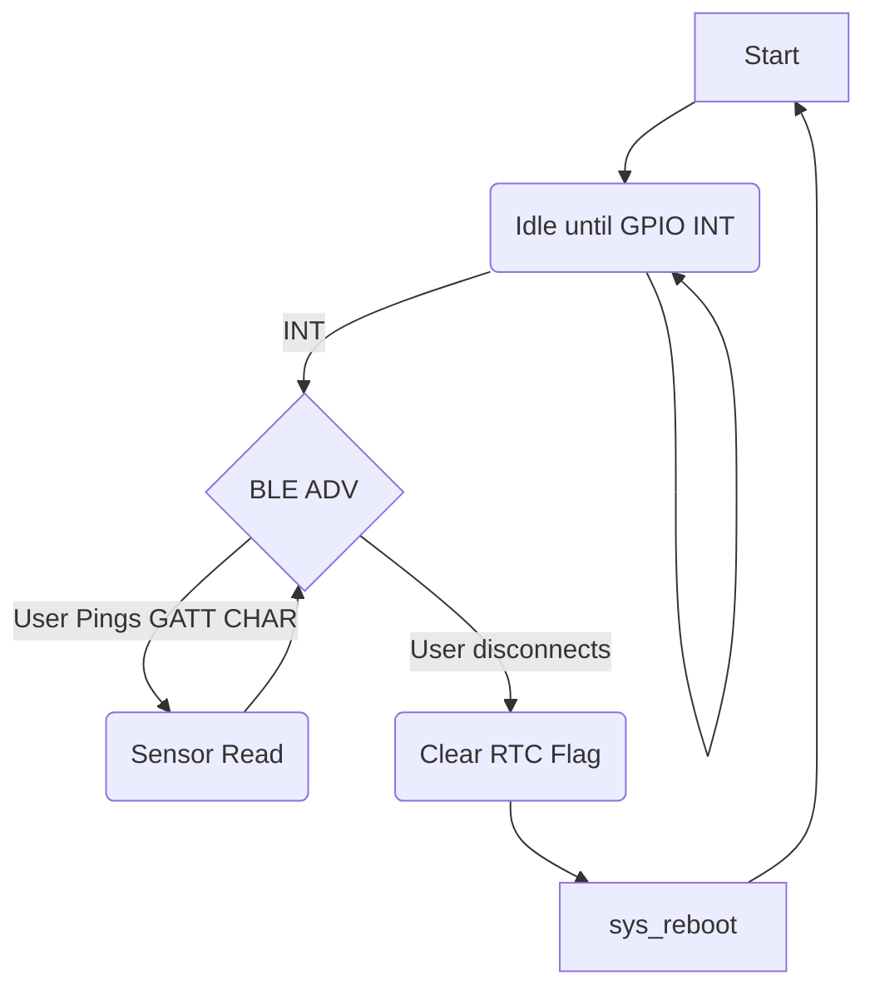

# nrf52840-dongle

Software application for nrf52840-dongle. The project was developed during the lecture on Sensor Design, held at the Warsaw University of Technology. The main application of this project was to measure vital human parameters using the device based on the idea of Energy Harvesting. 

The microcontroller was supposed to use as little power as possible, for this reason, the choice among the microcontrollers fell on the solution of the Nordic Semiconductors. The application was written with the use of the Zephyr OS framework. 

## Program Flow
The microcontroller on boot initializes only GPIO interrupt and with the use of k_cpu_idle() goes to deep sleep. If RTC is set properly interrupt should occur on pin 1.10, if not pin must be pulled down to GND to wake up the board. On the wakeup, the board initializes I2C, and BLE and starts advertising GATT characteristics. The user connects and with the read of each characteristic, the MCU sends requests to corresponding sensors and updates the data. When a user disconnects, the RTC flag is reset and the microcontroller reboots to an idle state again.

## Communication 
During development 4 GATT characteristics were implemented.

|ADDRESS         |Description                                                   |
|----------------|-------------------------------------------------------------|
|0x2220          |` System status, ex. loop counter and RTC Timer flag `       |
|0x5678          |` Test char, for debugging purposes`                         |
|0x6600          |` TMP102 temperature readings`                               |
|0x6660          |` RTC datetime information with timer interrupt settings`    |

### Additional info
- For the 0x6660 characteristic datetime is mapped to bytes in the following order:

    `=> day, month, year; sec, minute, hour; timer conf, timer min `
  
  Timer configuration corresponds to the PCF timer register parameter. Depending on that the timer min byte     sets the time counter how much it has to wait until interrupt. The user is also allowed to write the datatime under the characteristic.

- To correctly read the 0x6600 temperature characteristics there is a need for additional calculations:
The first byte is the MSB of the value. The second one is about the values after the decimal point. Temperature is sent in the Celsius degree. To read the temperature:
    `tmp = ((MSB << 4) + (LSB >> 4)) * 0.0625`

## Hardware
Application uses:
- Nordic nrf52840-Dongle,
- TMP102 temperature sensor breakout board,
- PCF8563 RTC breakout board,

## Power consumption
During the development, the power consumption was checked using the Power Profiler Kit. Power was connected to USB B pins to enable the bootloader mode of the nrf board.

Power consumed during sleep was valued at about 700 uA.

During the wakeup was valued at about 5 mA with all the sensors.

## Extras
- To test the connection with the board the Python script was written.
- The handling of the data was realized with the Node-Red platform. The temperature was visualized on the chart with a time course. There was also an idea of implementing the pulse sensor but was abandoned. The JSON file with the flow is also present under this repository

